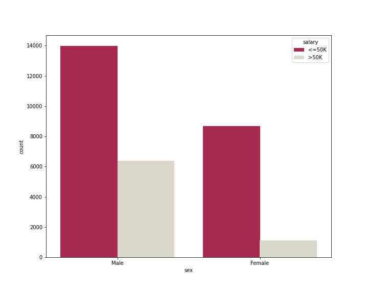
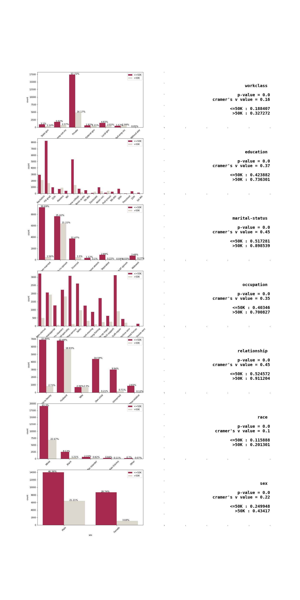
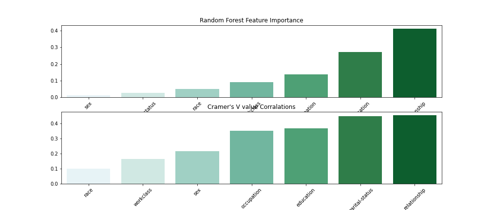

**___Note: This repo is similar to my other [project collection repo](https://github.com/enescavus/Data-Science-Projects) but in this one I will be uploading my algorithm based solutions with various hyperparameters for each model that I trained and deployed. Also you can find statistical approaches for different datasets/data types.___**

### Up-Coming Notebooks - Working On 
    
    - Decision Trees with hyperparameter tuning - Forests - Bagging(Bootstrap-Aggregation)
    - [DONE], Understanding Chi-Square & Cramer's V Test with Random Forest Feature Importance parameter (Visualized)
    - Clustering with Kmeans- DBSCAN and other optional algorithms may include
    - PCA ( dimensional reduction ) understanding
    - More EDA and Advenced Visualizations with seaborn (2D - 3D)
    ...

## Applied Statistics (Chi-Squared & Cramer's V) + EDA + ML Notebook w/ Income Data 

This notebook includes statistical analysis on categorical values. It is created for understanding categorical to categorical
data relationships. 

And also I compared statistical outputs with a machine learning algorithms feature importance function.

---

### **SavedFigures**

> Sample Visualization for categorical data and target feature relationship understanding

---

> All categorical features frequencies and correlation strength with target feature - visualized

---

> Cramer's V statistical anaysis values and Random Forest feature importance function output comparison

---

## Regression + EDA + ML Notebook w/ Graduate Admission Data 

This notebook has regression models and predictions of Graduate Admissions.

---

---

### To run these files locally

    - install anaconda or python virtual environment
    - intall pip
    - run comment > pip install -r requirements.txt
    - run notebook (shell command -> jupyter notebook)

### Libraries 

    scikit-learn
    numpy
    pandas
    matplotlib
    pillow
    scipy
    seaborn
    notebook

### Steps
    - Framing the Problem - Data Understanding
    - Loading Data and Explore (EDA)
    - Visualization Analysis - Graph Interpreting
    - Prepare the data to Machine Learning Algoritms
    - Explore diffirent (regression) models
    - Fine-Tuning models with GirdSearch
    - Conclusions
    
    
### Files
        -datasets
        -images
        -regression_eda_ml.ipynb
        -statistics_chi-squared-cramersV-RF-feature-importance.ipynb

### Data Source
[Data - graduation-admission](https://www.kaggle.com/mohansacharya/graduate-admissions)

[Data - chi-squared-cramer-v-adultIncome](https://www.kaggle.com/uciml/adult-census-income)

### Possible Further works for Graduation Data
    - Testing more Linear Algorithms
    - More fine-tuning and optimizations
    - Curve analysis
    
### Possible Further works for Income Data
    - Apply different imputition methods
    - Focus on ML instead EDA - overwrite
    - Use statistical results to choose features
    - Add other classification algorithms for ensembling

    
### Author
**___Enes Çavuş___** [Contact](https://www.linkedin.com/in/enes-cavus)